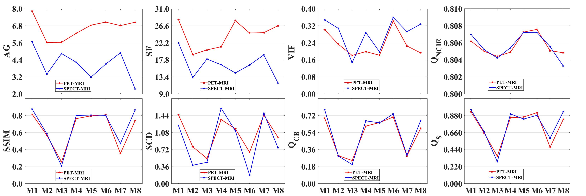

# MCAFusion (ICIG 2023)

Codes for ***Multimodal Medical Image Fusion based on Multi-channel Aggregated Network. (ICIG 2023)***

[Jingxue Huang](https://github.com/JasonWong30), [Xiaosong Li](https://github.com/lxs6), [Haishu Tan](https://www.fosu.edu.cn/mee/teachers/teachers-external/25647.html), [Xiaoqi Cheng](https://www.fosu.edu.cn/mee/teachers/teachers-jxdzgcx/20469.html)

-[*[Paper]*](https://link.springer.com/chapter/10.1007/978-3-031-46317-4_2)   

## Update

- [2025-1] README.md is updated.
- [2023-9] Codes and config files are public available.

## Citation

```
@inproceedings{huang2023multimodal,
  title={Multimodal Medical Image Fusion Based on Multichannel Aggregated Network},
  author={Huang, Jingxue and Li, Xiaosong and Tan, Haishu and Cheng, Xiaoqi},
  booktitle={International Conference on Image and Graphics},
  pages={14--25},
  year={2023},
  organization={Springer}
}
```

## Abstract

As a powerful and continuously sought-after medical assistance technique, multimodal medical image fusion integrates the useful information from different single-modal medical images into a fused one. Nevertheless, existing deep learning-based methods often feed source images into a single network without considering the information among different channels and scales, which may inevitably lose the important information. To solve this problem, we proposed a multimodal medical image fusion method based on multichannel aggregated network. By iterating different residual densely connected blocks to efficiently extract the image features at three scales, as well as extracting the spatial domain, channel and fine-grained feature information of the source image at each scale separately. Simultaneously, we introduced multispectral channel attention to address the global average pooling problem of the vanilla channel attention mechanism. Extensive fusion experiments demonstrated that the proposed method surpasses some representative state-of-the-art methods in terms of both subjective and objective evaluation. 

### 🌐 Usage

### ⚙ 1. Virtual Environment

```
 - [ ] torch  1.12.1
 - [ ] torchvision 0.13.1
 - [ ] numpy 1.24.2
 - [ ] Pillow  8.4.0
```

### 🏊 3. Data Preparation

Download the Multi-modal Medical Image Fusion (MMIF) and place the paired images in your own path.

### 🏄 4. Inference

If you want to infer with our MCAFusion and obtain the fusion results in our paper, please run

```
python test.py
```

## 🙌 MCAFusion

### Illustration of our MCAFusion method.


### Qualitative fusion results.


### Quantitative fusion results.

Medical Image Fusion



## 📖 Related Work
- Jingxue Huang, Tianshu Tan, Xiaosong Li, Tao Ye, Yanxiong Wu, *Multiple Attention Channels Aggregated Network for Multimodal Medical Image Fusion.* **Medical Physics 2024**. https://aapm.onlinelibrary.wiley.com/doi/abs/10.1002/mp.17607
